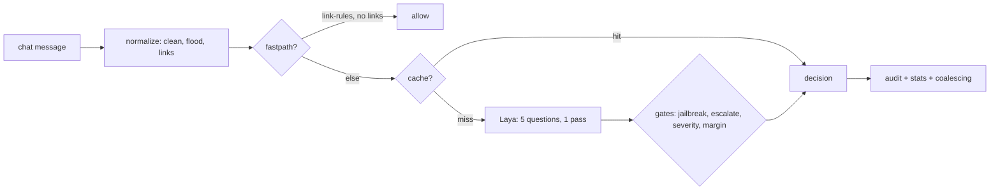

# Architecture (T140)

```mermaid
flowchart LR
    msg[chat message] --> norm[normalize: clean, flood, links]
    norm --> fp{fastpath?}
    fp -->|link-rules, no links| allow[allow]
    fp -->|else| cache{cache?}
    cache -->|hit| out[decision]
    cache -->|miss| model[Laya: 5 questions, 1 pass]
    model --> gate{gates: jailbreak, escalate, severity, margin}
    gate --> out
    out --> audit[audit + stats + coalescing]
```
